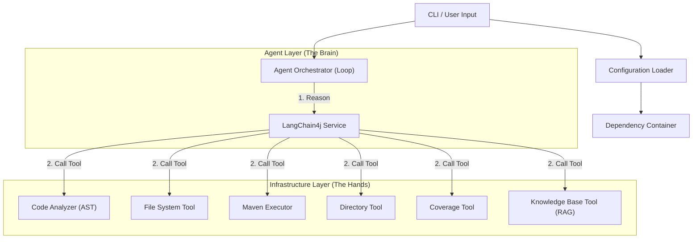

# Unit Test Agent 4j

企业级 Java 单元测试智能体 (Agent)，专注于为遗留系统 (Legacy Code) 自动生成高质量的 JUnit 5 + Mockito 测试代码。

## 核心特性

- **智能分析**: 基于 AST 分析代码结构，自动识别依赖并生成 Mock。
- **动态工具加载**: 运行时自动扫描并加载工具集。
- **丰富工具集**: 内置文件操作、目录遍历、代码分析、Maven 执行、覆盖率检查、RAG 知识库检索等多种工具。
- **自我修复**: 自动运行测试，分析错误日志并进行自我修正。
- **标准化**: 生成符合 JUnit 5 和 Mockito 标准的测试代码。
- **多模型支持**: 兼容 DeepSeek、OpenAI 以及任何兼容 OpenAI API 格式的大模型服务（如阿里云百炼）。基于 LangChain4j 1.10.0 构建。

## 快速开始

### 前置要求

- JDK 21+
- Maven 3.8+
- 设置 API Key（见下文）

### 构建项目

```bash
mvn clean package
```

构建成功后，可执行 Jar 包位于 `target/unit-test-agent-4j-0.1.0-INIT-shaded.jar`。

### 运行

#### 1. 配置

您可以使用 `config` 命令来设置 API Key 和其他选项。配置将保存在 JAR 包同级目录下的 `agent.yml` 中。

```bash
java -jar target/unit-test-agent-4j-0.1.0-INIT-shaded.jar config \
  --api-key "sk-your-api-key" \
  --base-url "https://api.deepseek.com" \
  --model "deepseek-coder"
```

#### 2. 生成测试

```bash
java -jar target/unit-test-agent-4j-0.1.0-INIT-shaded.jar \
  --target src/main/java/com/example/MyService.java
```

#### 3. 运行时覆盖

您也可以在运行时直接指定参数，并选择是否保存到配置文件：

```bash
# 仅本次运行生效
java -jar target/unit-test-agent-4j-0.1.0-INIT-shaded.jar \
  --target src/main/java/com/example/MyService.java \
  --model "gpt-4"

# 运行并更新配置文件 (--save)
java -jar target/unit-test-agent-4j-0.1.0-INIT-shaded.jar \
  --target src/main/java/com/example/MyService.java \
  --api-key "new-key" \
  --save
```

## 配置指南

Agent 支持多级配置加载机制，优先级如下：
1. 命令行参数 (`--api-key`, `--model`, `--base-url`)
2. CLI 指定配置文件 (`--config`)
3. **JAR 包所在目录 (`agent.yml`) - 推荐全局配置位置**
4. 当前运行目录 (`./config.yml`, `./agent.yml`)
5. 用户主目录 (`~/.unit-test-agent/config.yml`)
6. Classpath 默认配置

### 应用配置 (`agent.yml`)

```yaml
# LLM 设置 兼容 openAI
llm:
  provider: "deepseek" # deepseek | openai
  apiKey: "${env:AGENT_API_KEY}" # 支持读取环境变量
  # 可选: 自定义 API 地址 (例如使用阿里云百炼)
  baseUrl: "${env:AGENT_BASE_URL}" # 支持读取环境变量
  modelName: "${env:AGENT_MODEL_NAME}" # 支持读取环境变量，例如 deepseek-coder-v2
  temperature: 0.1
  timeout: 120 # 秒

# 工作流设置
workflow:
  maxRetries: 3
  dryRun: false
```

## 开发架构

系统采用 **Agent-Tool** 架构：

1.  **Agent Layer**: 负责推理和任务编排 (LangChain4j)。
2.  **Infrastructure Layer**: 实际执行文件操作和命令的工具 (FileSystemTool, MavenExecutorTool)。


