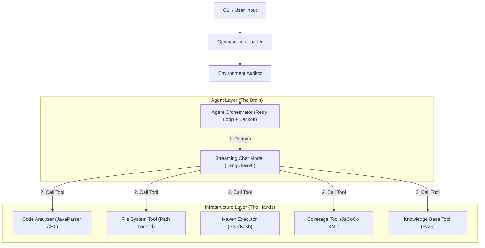

# Unit Test Agent 4j

An enterprise-grade Java Unit Test Agent focusing on automatically generating high-quality JUnit 5 + Mockito test code for legacy systems.

## Core Features

- **Multi-Model Native Support**: Native support for OpenAI, Anthropic (Claude), and Gemini protocols, compatible with various OpenAI-format proxies.
- **Intelligent Environment Audit**: Automatically detects project dependencies (JUnit 5, Mockito, JaCoCo, etc.) and their versions upon startup, providing alerts for low versions or missing dependencies.
- **Self-Healing Mechanism**: The Agent automatically compiles and runs generated tests, and repairs test code or `pom.xml` based on error logs (e.g., version conflicts, missing dependencies, syntax errors).
- **Standardized Testing**: Enforces adherence to JUnit 5 (`@ExtendWith(MockitoExtension.class)`), Mockito (`@Mock`, `@InjectMocks`), and `mockito-inline` (supporting static class mocking) standards.
- **Project Root Protection**: Automatically identifies `pom.xml` to lock the project root directory, ensuring safe and controllable file operations and preventing path hallucinations.
- **Exponential Backoff Retry**: Automatically performs exponential backoff retries for API rate limits to improve task success rates.
- **RAG Knowledge Base**: Supports retrieving existing unit test cases or development manuals to ensure generated code style is consistent with the project.
- **Coverage-Driven Enhancement**: Automatically detects if coverage reaches the threshold; if not, it analyzes uncovered methods and supplements test cases automatically.
- **ERP Project Adaptation**: Optimized for enterprise Java projects, supporting complex dependency injection, transaction boundaries, DTO mapping, and more.

## Quick Start

### Prerequisites

- JDK 21+
- Maven 3.8+
- Set API Key (see below)

### Build Project

```bash
mvn clean package
```

After a successful build, the executable Jar is located at `target/unit-test-agent-4j-0.1.0-LITE-shaded.jar`.

### Running

#### 1. Configuration

Use the `config` command to set global configuration, saved to `agent.yml`.

```bash
# Example for Gemini protocol
java -jar target/unit-test-agent-4j-0.1.0-LITE-shaded.jar config \
  --protocol gemini \
  --api-key "sk-..." \
  --model "gemini-1.5-pro" \
  --temperature 0.0

# Example for OpenAI protocol (e.g., Alibaba Cloud Bailian)
java -jar target/unit-test-agent-4j-0.1.0-LITE-shaded.jar config \
  --protocol openai \
  --api-key "sk-..." \
  --base-url "https://dashscope.aliyuncs.com/compatible-mode/v1" \
  --model "qwen-max"
```

#### 2. Generate Tests

**Single File Mode**: Generate tests for a specific file
```bash
java -jar target/unit-test-agent-4j-0.1.0-LITE-shaded.jar \
  --target src/main/java/com/example/MyService.java
```

**Batch Mode**: Scan the entire project and automatically identify classes needing tests
```bash
# Scan entire project
java -jar target/unit-test-agent-4j-0.1.0-LITE-shaded.jar \
  --project E:\MyProject

# With exclusion rules (exclude DTOs, VOs, etc.)
java -jar target/unit-test-agent-4j-0.1.0-LITE-shaded.jar \
  --project E:\MyProject \
  --exclude "**/dto/**,**/vo/**,**/domain/**"

# Set coverage threshold
java -jar target/unit-test-agent-4j-0.1.0-LITE-shaded.jar \
  --project E:\MyProject \
  --threshold 70

# Dry-run mode (analysis only, no generation)
java -jar target/unit-test-agent-4j-0.1.0-LITE-shaded.jar \
  --project E:\MyProject \
  --dry-run
```

#### 3. CLI Parameter Overrides

```bash
java -jar target/unit-test-agent-4j-0.1.0-LITE-shaded.jar \
  --target src/main/java/com/example/MyService.java \
  --protocol anthropic \
  --model "claude-3-5-sonnet-20240620" \
  --temperature 0.1 \
  --max-retries 5
```

#### 4. Interactive Mode

Use `-i` or `--interactive` to enable interactive confirmation mode, allowing you to preview and confirm before files are written:

```bash
java -jar target/unit-test-agent-4j-0.1.0-LITE-shaded.jar \
  --target src/main/java/com/example/MyService.java \
  -i
```

In interactive mode, before each file write, it displays:
- Operation type (Create new file / Overwrite / Modify)
- File path
- Content preview (first 30 lines)
- Confirmation options: `Y` (Confirm) / `n` (Cancel) / `v` (View full content)

## Configuration Guide

The Agent searches for `agent.yml` in the following order:
1. CLI parameter `--config`
2. **Directory where the JAR is located (Recommended)**
3. Current working directory
4. User home directory (`~/.unit-test-agent/`)

### Full Configuration (`agent.yml`)

```yaml
# LLM Settings
llm:
  protocol: "openai" # Supported: openai | anthropic | gemini
  apiKey: "${env:UT_AGENT_API_KEY}" # Supports environment variables
  baseUrl: "${env:UT_AGENT_BASE_URL}" # Automatically handles /v1 or /v1beta suffixes
  modelName: "${env:UT_AGENT_MODEL_NAME}"
  temperature: 0.0 # Recommended: 0.0 (Precise) or 0.1 (Slightly creative)
  timeout: 120 # Timeout (seconds)
  customHeaders: {} # Custom HTTP headers

# Workflow Settings
workflow:
  maxRetries: 3 # Max retries after task failure
  coverageThreshold: 80 # Coverage threshold (%), supplements tests if not reached
  interactive: false # Interactive confirmation mode

# Batch Mode Settings
batch:
  excludePatterns: "" # Exclusion rules (glob pattern, comma-separated)
  dryRun: false # Analysis only, no generation

# Recommended Dependencies and Minimum Versions (used for environment self-check)
dependencies:
  junit-jupiter: "5.10.1"
  mockito-core: "5.8.0"
  mockito-junit-jupiter: "5.8.0"
  mockito-inline: "5.8.0"
  jacoco-maven-plugin: "0.8.11"

# Prompts Configuration
prompts:
  system: "prompts/system-prompt.st"

# MCP Configuration
mcp:
  servers: []

# Skills Configuration
skills: []
```

## Architecture

The system adopts an **Agent-Tool** architecture:

1.  **Agent Layer**: Responsible for reasoning, task orchestration, and self-healing logic (based on LangChain4j).
2.  **Infrastructure Layer**: Toolset for executing specific tasks (File I/O, AST parsing, Maven commands, etc.).



## Platform Compatibility
- **Windows**: Priority detection and use of **PowerShell 7 (pwsh)**, automatically handling Windows path encoding.
- **Linux/macOS**: Uses standard `sh` and `mvn` commands.

## Batch Mode (Precise Unit Test Generation)

Batch mode reduces LLM calls through pre-analysis, generating tests only for uncovered or low-coverage methods.

### Workflow

1. **Scan Project**: Identify core code classes under `src/main/java`.
2. **Exclude Non-Core Classes**: Automatically exclude DTO, VO, Entity, Enum, and other data classes.
3. **Analyze Coverage**: Read JaCoCo reports to identify uncovered methods.
4. **Precise Generation**: Call LLM only for methods requiring tests.

## Coverage-Driven Testing

The Agent supports coverage-driven test enhancement to ensure generated tests reach the specified threshold.

### Workflow

1. Generate initial tests and run them.
2. Check if coverage reaches the threshold (default 80%).
3. If not reached, analyze uncovered methods.
4. Automatically supplement targeted test cases.
5. Repeat until reached or no further improvement possible.
