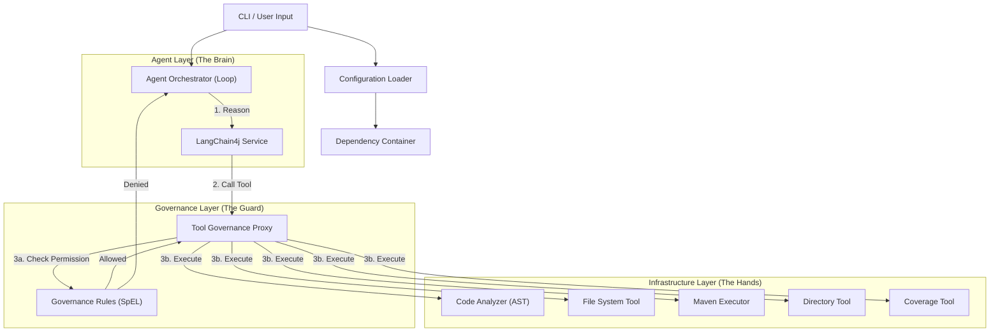

# Unit Test Agent 4j

企业级 Java 单元测试智能体 (Agent)，专注于为遗留系统 (Legacy Code) 自动生成高质量的 JUnit 5 + Mockito 测试代码。

采用 **"Governance-by-Design"** 架构，内置工具治理中间件，对 AI 的所有工具调用（文件读写、命令执行）进行透明的权限拦截和安全治理，确保企业资产安全。

## 核心特性

- **安全治理**: 严格限制 AI 的文件写权限（仅限 `src/test`）和命令执行权限，内置 SpEL 规则引擎。
- **智能分析**: 基于 AST 分析代码结构，自动识别依赖并生成 Mock。
- **动态工具加载**: 运行时自动扫描并加载工具集，基于接口自动生成安全代理。
- **丰富工具集**: 内置文件操作、目录遍历、代码分析、Maven 执行、覆盖率检查等多种工具。
- **自我修复**: 自动运行测试，分析错误日志并进行自我修正。
- **标准化**: 生成符合 JUnit 5 和 Mockito 标准的测试代码。
- **多模型支持**: 兼容 DeepSeek、OpenAI 以及任何兼容 OpenAI API 格式的大模型服务（如阿里云百炼）。基于 LangChain4j 1.10.0 构建。

## 快速开始

### 前置要求

- JDK 21+
- Maven 3.8+
- 设置 `AGENT_API_KEY` 环境变量

### 构建项目

```bash
mvn clean package
```

构建成功后，可执行 Jar 包位于 `target/unit-test-agent-4j-0.1.0-INIT-shaded.jar`。

### 运行

使用默认配置运行（默认查找当前目录 `agent.yml` 或 `config.yml`）：

```bash
export AGENT_API_KEY="sk-your-api-key"
java -jar target/unit-test-agent-4j-0.1.0-INIT-shaded.jar --target src/main/java/com/example/MyService.java
```

指定自定义配置文件：

```bash
java -jar target/unit-test-agent-4j-0.1.0-INIT-shaded.jar \
  --config my-agent-config.yml \
  --target src/main/java/com/example/LegacyService.java
```

## 配置指南

Agent 支持多级配置加载机制，优先级如下：
1. 命令行参数 (`--config`)
2. 当前目录 (`./config.yml`, `./agent.yml`)
3. 用户主目录 (`~/.unit-test-agent/config.yml`, `~/.unit-test-agent/agent.yml`)
4. Classpath 默认配置

**注意：** 治理策略 (`governance.yml`) 现已内置，用户不可修改。

### 1. 应用配置 (`agent.yml` / `config.yml`)

```yaml
# LLM 设置 兼容 openAI
llm:
  provider: "deepseek" # deepseek | openai
  apiKey: "${env:AGENT_API_KEY}" # 支持读取环境变量
  # 可选: 自定义 API 地址 (例如使用阿里云百炼)
  baseUrl: "${env:AGENT_BASE_URL}" # 支持读取环境变量
  modelName: "${env:AGENT_MODEL_NAME}" # 支持读取环境变量，例如 deepseek-coder-v2
  temperature: 0.1
  timeout: 120 # 秒

# 工作流设置
workflow:
  maxRetries: 3
  dryRun: false
```

### 2. 治理策略 (`governance.yml`)

```yaml
enabled: true
policy:
  # 规则1: 允许读取 src 目录下的所有文件 (用于代码分析)
  - resource: "file-read"
    action: "ALLOW"
    condition: "path.startsWith('src/')"
    
  # 规则2: 仅允许写入 src/test 目录 (核心安全策略)
  - resource: "file-write"
    action: "ALLOW"
    condition: "path.contains('/src/test/java/')"
    
  # 规则3: 仅允许执行 mvn test 命令，且限制类名格式 (支持内部类 $, 方法 #, 通配符 *)
  - resource: "shell-exec"
    action: "ALLOW"
    condition: "testClassName.matches('[a-zA-Z0-9_$.#*-]+')"
```

## 开发架构

系统采用 **Agent-Middleware-Tool** 三层架构：

1.  **Agent Layer**: 负责推理和任务编排 (LangChain4j)。
2.  **Governance Layer**: 内置透明代理层，拦截并校验所有工具调用 (ToolGovernanceProxy + SpEL)。
3.  **Infrastructure Layer**: 实际执行文件操作和命令的工具 (FileSystemTool, MavenExecutorTool)。


