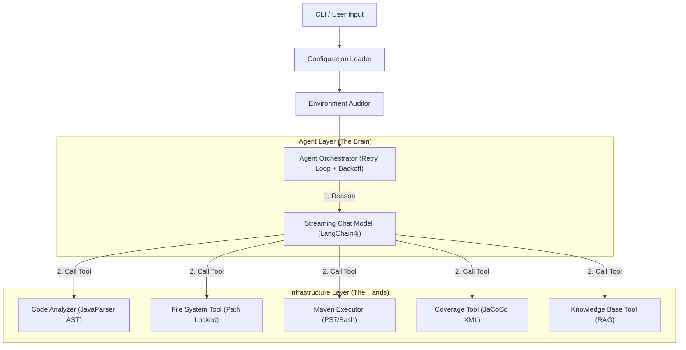

# Unit Test Agent 4j

企业级 Java 单元测试智能体 (Agent)，专注于为遗留系统 (Legacy Code) 自动生成高质量的 JUnit 5 + Mockito 测试代码。

## 核心特性

- **多模型原生支持**: 原生支持 OpenAI、Anthropic (Claude) 和 Gemini 协议，并兼容各类 OpenAI 格式代理。
- **智能环境审计**: 启动时自动检测项目依赖（JUnit 5, Mockito, JaCoCo 等）及其版本，发现低版本或缺失时自动提示。
- **自我修复机制**: Agent 会自动编译并运行生成的测试，根据错误日志（如版本冲突、缺少依赖、语法错误）自动修复测试代码或 `pom.xml`。
- **标准化测试**: 强制遵循 JUnit 5 (`@ExtendWith(MockitoExtension.class)`)、Mockito (`@Mock`, `@InjectMocks`) 以及 `mockito-inline`（支持静态类 Mock）标准。
- **项目根目录保护**: 自动识别 `pom.xml` 锁定项目根目录，确保文件操作安全可控，防止路径幻觉。
- **指数退避重试**: 针对 API 速率限制 (Rate Limit) 自动进行指数退避重试，提高任务成功率。
- **RAG 知识库**: 支持通过检索现有单测案例或开发手册，确保生成的代码风格与项目一致。

## 快速开始

### 前置要求

- JDK 21+
- Maven 3.8+
- 设置 API Key（见下文）

### 构建项目

```bash
mvn clean package
```

构建成功后，可执行 Jar 包位于 `target/unit-test-agent-4j-0.1.0-LITE-shaded.jar`。

### 运行

#### 1. 配置

使用 `config` 命令设置全局配置，保存至 `agent.yml`。

```bash
# 设置 Gemini 协议示例
java -jar target/unit-test-agent-4j-0.1.0-LITE-shaded.jar config \
  --protocol gemini \
  --api-key "sk-..." \
  --model "gemini-1.5-pro" \
  --temperature 0.0

# 设置 OpenAI 协议示例 (如阿里云百炼)
java -jar target/unit-test-agent-4j-0.1.0-LITE-shaded.jar config \
  --protocol openai \
  --api-key "sk-..." \
  --base-url "https://dashscope.aliyuncs.com/compatible-mode/v1" \
  --model "qwen-max"
```

#### 2. 生成测试

```bash
java -jar target/unit-test-agent-4j-0.1.0-LITE-shaded.jar \
  --target src/main/java/com/example/MyService.java
```

#### 3. 命令行参数覆盖

```bash
java -jar target/unit-test-agent-4j-0.1.0-LITE-shaded.jar \
  --target src/main/java/com/example/MyService.java \
  --protocol anthropic \
  --model "claude-3-5-sonnet-20240620" \
  --temperature 0.1 \
  --max-retries 5
```

## 配置指南

Agent 会按以下顺序搜索 `agent.yml`：
1. 命令行参数 `--config`
2. **JAR 包所在目录 (推荐)**
3. 当前运行目录
4. 用户主目录 (`~/.unit-test-agent/`)

### 完整配置 (`agent.yml`)

```yaml
# LLM 设置
llm:
  protocol: "openai" # 支持: openai | anthropic | gemini
  apiKey: "${env:UT_AGENT_API_KEY}" # 支持读取环境变量
  baseUrl: "${env:UT_AGENT_BASE_URL}" # 自动处理 /v1 或 /v1beta 后缀
  modelName: "${env:UT_AGENT_MODEL_NAME}"
  temperature: 0.0 # 推荐值: 0.0 (精确) 或 0.1 (稍带创造性)
  timeout: 120 # 超时时间 (秒)

# 工作流设置
workflow:
  maxRetries: 3 # 任务失败后的最大重试次数

# 推荐依赖及最低版本 (环境自检使用)
dependencies:
  junit-jupiter: "5.10.1"
  mockito-core: "5.8.0"
  mockito-junit-jupiter: "5.8.0"
  mockito-inline: "5.8.0"
  jacoco-maven-plugin: "0.8.11"
```

## 开发架构

系统采用 **Agent-Tool** 架构：

1.  **Agent Layer**: 负责推理、任务编排和自我修复逻辑 (基于 LangChain4j)。
2.  **Infrastructure Layer**: 负责执行具体任务的工具集（文件 IO、AST 解析、Maven 指令等）。



## 平台兼容性
- **Windows**: 优先探测并使用 **PowerShell 7 (pwsh)**，自动处理 Windows 路径编码。
- **Linux/macOS**: 使用标准 `sh` 和 `mvn` 指令。
