# Unit Test Agent 4j

An enterprise-grade Java Unit Test Agent that automatically generates high-quality JUnit 5 + Mockito test code for legacy systems.

[](https://openjdk.java.net/)
[](https://maven.apache.org/)
[](LICENSE)

## Table of Contents

- [Features](#features)
- [Installation](#installation)
- [Quick Start](#quick-start)
- [Usage Guide](#usage-guide)
  - [Single File Mode](#single-file-mode)
  - [Batch Mode](#batch-mode)
  - [Incremental Mode](#incremental-mode)
  - [Interactive Mode](#interactive-mode)
- [Command Line Reference](#command-line-reference)
- [Configuration](#configuration)
- [Available Tools](#available-tools)
- [Architecture](#architecture)
- [Troubleshooting](#troubleshooting)
- [Contributing](#contributing)

## Features

| Feature | Description |
|---------|-------------|
| **Multi-Model Support** | Native support for OpenAI, Anthropic (Claude), Gemini, and OpenAI-compatible proxies |
| **Intelligent Environment Audit** | Auto-detects project dependencies (JUnit 5, Mockito, JaCoCo) and version compatibility |
| **Self-Healing Mechanism** | Automatically compiles and runs tests, repairs code based on error logs |
| **Standardized Testing** | Enforces JUnit 5 + Mockito + mockito-inline standards |
| **Project Root Protection** | Locks project root via `pom.xml` detection, prevents path hallucinations |
| **Exponential Backoff Retry** | Handles API rate limits with intelligent retry logic |
| **RAG Knowledge Base** | Retrieves existing tests and docs to ensure consistent code style |
| **Coverage-Driven Enhancement** | Analyzes uncovered methods and supplements tests automatically |
| **Git Incremental Detection** | Only generates tests for changed files (uncommitted/staged/between refs) |
| **Mutation Testing** | Integrates PITest to assess test effectiveness |
| **LSP Syntax Checking** | Optional Eclipse JDT Language Server integration for semantic analysis (auto-download) |
| **Pre-compile Validation** | JavaParser-based fast syntax checking before compilation |

## Installation

### Prerequisites

- **JDK 21+** (required)
- **Maven 3.8+** (required, for building from source)
- **Git** (required, for cloning and building)

### Quick Install (Recommended)

The easiest way to install is to use our automated build script that clones the source, checks the environment, builds the project, and installs it for you.

#### Linux / macOS

```bash
# Clone, build, and install in one command
curl -sSL https://raw.githubusercontent.com/codelogickeep/unit-test-agent-4j/main/build.sh | bash

# Add to PATH (add to your ~/.bashrc or ~/.zshrc)
export PATH="$PATH:$HOME/.utagent"
```

#### Windows (PowerShell 7+)

```powershell
# Clone, build, and install in one command
irm https://raw.githubusercontent.com/codelogickeep/unit-test-agent-4j/main/build.ps1 | iex

# Add to PATH manually: $env:USERPROFILE\.utagent
```

The build script will:
1. Check your environment (Java 21+, Maven 3.8+, Git)
2. Clone the source code
3. Build the project with Maven (takes 2-5 minutes)
4. Install `utagent` command to `~/.utagent` (or `%USERPROFILE%\.utagent` on Windows)
5. Clean up build files

After installation:

```bash
# Configure API key
utagent config --protocol openai --api-key "sk-..." --model "gpt-4"

# Generate tests
utagent --target src/main/java/com/example/MyService.java
```

### Manual Build from Source

```bash
# Clone the repository
git clone https://github.com/codelogickeep/unit-test-agent-4j.git
cd unit-test-agent-4j

# Build the project
mvn clean package -DskipTests

# The executable JAR is at:
# target/utagent.jar
```

### Verify Installation

```bash
# If using one-click install
utagent --help

# If building from source
java -jar target/utagent.jar --help
```

## Quick Start

### Step 1: Configure API Key

```bash
# Option A: Use config command (recommended)
utagent config \
  --protocol openai \
  --api-key "sk-your-api-key" \
  --model "gpt-4o"

# Option B: Set environment variable
export OPENAI_API_KEY="sk-your-api-key"
```

### Step 2: Generate Your First Test

```bash
# If using one-click install
utagent --target src/main/java/com/example/MyService.java

# If building from source
java -jar target/utagent.jar --target src/main/java/com/example/MyService.java
```

### Step 3: Check the Output

The agent will:
1. Analyze the source file
2. Generate test class at `src/test/java/com/example/MyServiceTest.java`
3. Compile and run the tests
4. Fix any failures automatically

## Usage Guide

### Single File Mode

Generate tests for a specific Java source file.

```bash
# Basic usage
java -jar utagent.jar --target path/to/MyService.java

# With knowledge base for style matching
java -jar utagent.jar \
  --target path/to/MyService.java \
  -kb src/test/java

# With interactive confirmation
java -jar utagent.jar \
  --target path/to/MyService.java \
  --interactive

# With custom coverage threshold
java -jar utagent.jar \
  --target path/to/MyService.java \
  --threshold 90
```

### Batch Mode

Scan an entire project and generate tests for all classes needing coverage.

```bash
# Scan entire project
java -jar utagent.jar --project /path/to/project

# With exclusion rules
java -jar utagent.jar \
  --project /path/to/project \
  --exclude "**/dto/**,**/vo/**,**/entity/**"

# Dry-run mode (analysis only)
java -jar utagent.jar \
  --project /path/to/project \
  --dry-run

# Limit batch size
java -jar utagent.jar \
  --project /path/to/project \
  --batch-limit 10
```

**Built-in Exclusion Patterns:**
- `**/dto/**`, `**/vo/**`, `**/domain/**`
- `**/*DTO.java`, `**/*VO.java`, `**/*Entity.java`
- `**/*Enum.java`, `**/*Criteria.java`
- `**/dao/**/*DAO.java`, `**/repo/**/*Repo.java`

### Incremental Mode

Only generate tests for files changed in Git.

```bash
# Test uncommitted changes (working directory + staged)
java -jar utagent.jar \
  --project /path/to/project \
  --incremental

# Test only staged changes
java -jar utagent.jar \
  --project /path/to/project \
  --incremental \
  --incremental-mode STAGED_ONLY

# Compare two refs (e.g., feature branch vs main)
java -jar utagent.jar \
  --project /path/to/project \
  --incremental \
  --incremental-mode COMPARE_REFS \
  --base-ref main \
  --target-ref HEAD

# Compare specific commits
java -jar utagent.jar \
  --project /path/to/project \
  --incremental \
  --incremental-mode COMPARE_REFS \
  --base-ref abc123 \
  --target-ref def456
```

**Incremental Modes:**
| Mode | Description |
|------|-------------|
| `UNCOMMITTED` | Changes in working directory + staged (default) |
| `STAGED_ONLY` | Only staged changes |
| `COMPARE_REFS` | Compare two Git refs (branches, commits, tags) |

### Interactive Mode

Preview and confirm each file write operation.

```bash
java -jar utagent.jar \
  --target path/to/MyService.java \
  -i
```

### Skill-based Tool Selection

Reduce token usage by loading only relevant tools for specific tasks.

```bash
# Use analysis skill (6 tools instead of 15)
java -jar utagent.jar \
  --target path/to/MyService.java \
  --skill analysis

# Use generation skill for test writing
java -jar utagent.jar \
  --target path/to/MyService.java \
  --skill generation

# Use verification skill for running tests
java -jar utagent.jar \
  --target path/to/MyService.java \
  --skill verification
```

**Built-in Skills:**

| Skill | Description | Tools | Token Savings |
|-------|-------------|-------|---------------|
| `analysis` | Code analysis phase | 6 | ~60% |
| `generation` | Test generation phase | 5 | ~65% |
| `verification` | Test verification phase | 5 | ~65% |
| `repair` | Fix failing tests | 5 | ~65% |
| `full` | All tools (default) | 15 | baseline |

**Interactive Prompts:**
```
╔══════════════════════════════════════════════════════════════════╗
║ WRITE FILE: src/test/java/com/example/MyServiceTest.java         ║
║ Operation: CREATE NEW FILE                                       ║
╟──────────────────────────────────────────────────────────────────╢
║ Preview (first 30 lines):                                        ║
║                                                                  ║
║ package com.example;                                             ║
║                                                                  ║
║ import org.junit.jupiter.api.Test;                               ║
║ import org.junit.jupiter.api.extension.ExtendWith;               ║
║ ...                                                              ║
╟──────────────────────────────────────────────────────────────────╢
║ [Y] Confirm  [n] Cancel  [v] View full content                   ║
╚══════════════════════════════════════════════════════════════════╝
```

## Command Line Reference

### Global Options

| Option | Short | Description | Default |
|--------|-------|-------------|---------|
| `--config` | `-c` | Path to config file | auto-detect |
| `--protocol` | | LLM protocol (openai/anthropic/gemini) | from config |
| `--api-key` | | API key | from config/env |
| `--base-url` | | API base URL | protocol default |
| `--model` | `-m` | Model name | from config |
| `--temperature` | `-t` | Sampling temperature (0.0-1.0) | 0.0 |
| `--timeout` | | Request timeout in seconds | 120 |
| `--max-retries` | | Max retry attempts | 3 |
| `--verbose` | `-v` | Enable verbose logging | false |
| `--help` | `-h` | Show help message | |

### Target Options

| Option | Short | Description | Example |
|--------|-------|-------------|---------|
| `--target` | | Single source file path | `src/main/java/Foo.java` |
| `--project` | `-p` | Project root for batch mode | `/path/to/project` |
| `--exclude` | `-e` | Exclusion patterns (comma-separated) | `**/dto/**,**/vo/**` |
| `--threshold` | | Coverage threshold % | 80 |
| `--dry-run` | | Analysis only, no generation | |
| `--batch-limit` | | Max classes to process | unlimited |

### Incremental Options

| Option | Description | Example |
|--------|-------------|---------|
| `--incremental` | Enable incremental mode | |
| `--incremental-mode` | Mode: UNCOMMITTED/STAGED_ONLY/COMPARE_REFS | `COMPARE_REFS` |
| `--base-ref` | Base Git ref for comparison | `main`, `HEAD~1`, `abc123` |
| `--target-ref` | Target Git ref for comparison | `HEAD`, `feature-branch` |

### Knowledge Base Options

| Option | Short | Description | Example |
|--------|-------|-------------|---------|
| `-kb` | | Knowledge base path | `src/test/java` |
| `--kb-types` | | File types to index | `java,md,yml` |

### Interactive Options

| Option | Short | Description |
|--------|-------|-------------|
| `--interactive` | `-i` | Enable interactive confirmation mode |

### Skill Options (Dynamic Tool Selection)

| Option | Description | Example |
|--------|-------------|---------|
| `--skill` | Use specific skill's tool subset | `analysis`, `generation`, `verification` |

## Configuration

### Configuration File Locations

The agent searches for `agent.yml` in the following order:

1. `--config` CLI parameter
2. **JAR directory** (recommended)
3. Current working directory
4. User home directory (`~/.unit-test-agent/`)

### Full Configuration Reference (`agent.yml`)

```yaml
# ═══════════════════════════════════════════════════════════════════
# LLM Settings
# ═══════════════════════════════════════════════════════════════════
llm:
  # Protocol: openai | openai-zhipu | anthropic | gemini
  protocol: "openai"
  
  # API Key - supports environment variable syntax
  apiKey: "${env:UT_AGENT_API_KEY}"
  
  # Base URL - auto-handles /v1 or /v1beta suffixes
  # Examples:
  #   - OpenAI: https://api.openai.com (default)
  #   - Azure: https://your-resource.openai.azure.com
  #   - Alibaba: https://dashscope.aliyuncs.com/compatible-mode/v1
  baseUrl: "${env:UT_AGENT_BASE_URL}"
  
  # Model name
  modelName: "${env:UT_AGENT_MODEL_NAME}"
  
  # Temperature: 0.0 (precise) to 1.0 (creative)
  # Recommended: 0.0 for code generation
  temperature: 0.0
  
  # Request timeout in seconds
  timeout: 120
  
  # Custom HTTP headers (for proxies or auth)
  customHeaders:
    # X-Custom-Header: "value"

# ═══════════════════════════════════════════════════════════════════
# Workflow Settings
# ═══════════════════════════════════════════════════════════════════
workflow:
  # Max retries on failure (with exponential backoff)
  maxRetries: 3
  
  # Coverage threshold (%) - auto-supplements tests if not reached
  coverageThreshold: 80
  
  # Interactive mode - confirm before each file write
  interactive: false
  
  # Enable LSP syntax checking (auto-downloads JDT LS 1.50.0)
  # Provides full semantic analysis: type errors, missing imports
  use-lsp: false
  
  # Enable mutation testing (requires PITest in pom.xml)
  # enableMutationTesting: false
  
  # Max feedback loop iterations
  # maxFeedbackLoopIterations: 3

# ═══════════════════════════════════════════════════════════════════
# Batch Mode Settings
# ═══════════════════════════════════════════════════════════════════
batch:
  # Exclusion patterns (glob, comma-separated)
  excludePatterns: "**/dto/**,**/vo/**,**/entity/**"
  
  # Dry-run mode - analyze only, no generation
  dryRun: false

# ═══════════════════════════════════════════════════════════════════
# Incremental Mode Settings
# ═══════════════════════════════════════════════════════════════════
incremental:
  # Mode: UNCOMMITTED | STAGED_ONLY | COMPARE_REFS
  mode: UNCOMMITTED
  
  # Git refs for COMPARE_REFS mode
  # baseRef: "main"
  # targetRef: "HEAD"
  
  # Exclusion patterns for file paths
  # excludePatterns: ".*Test\\.java"

# ═══════════════════════════════════════════════════════════════════
# Recommended Dependencies (for environment self-check)
# ═══════════════════════════════════════════════════════════════════
dependencies:
  junit-jupiter: "5.10.1"
  mockito-core: "5.8.0"
  mockito-junit-jupiter: "5.8.0"
  mockito-inline: "5.8.0"
  jacoco-maven-plugin: "0.8.11"

# ═══════════════════════════════════════════════════════════════════
# Prompts Configuration
# ═══════════════════════════════════════════════════════════════════
prompts:
  # System prompt template path (file or classpath resource)
  system: "prompts/system-prompt.st"

# ═══════════════════════════════════════════════════════════════════
# MCP Configuration (Model Context Protocol)
# ═══════════════════════════════════════════════════════════════════
mcp:
  servers: []

# ═══════════════════════════════════════════════════════════════════
# Skills Configuration (Dynamic Tool Selection)
# Reduces token usage by ~60-70% by only loading relevant tools
# ═══════════════════════════════════════════════════════════════════
skills:
  - name: "analysis"
    description: "Code analysis phase"
    tools: [CodeAnalyzerTool, FileSystemTool, BoundaryAnalyzerTool, StyleAnalyzerTool, ProjectScannerTool, TestDiscoveryTool]
  - name: "generation"
    description: "Test generation phase"
    tools: [FileSystemTool, DirectoryTool, KnowledgeBaseTool, SyntaxCheckerTool, CodeAnalyzerTool]
  - name: "verification"
    description: "Test verification phase"
    tools: [MavenExecutorTool, TestReportTool, CoverageTool, FileSystemTool, MutationTestTool]
  - name: "repair"
    description: "Repair phase"
    tools: [FileSystemTool, TestReportTool, CodeAnalyzerTool, SyntaxCheckerTool, MavenExecutorTool]
  - name: "full"
    description: "Full toolset (default)"
    tools: []  # Empty = use all tools

# Set default skill in workflow section:
# workflow:
#   default-skill: "analysis"
```

### Environment Variables

| Variable | Description | Example |
|----------|-------------|---------|
| `UT_AGENT_API_KEY` | LLM API key | `sk-xxx` |
| `UT_AGENT_BASE_URL` | LLM API base URL | `https://api.openai.com` |
| `UT_AGENT_MODEL_NAME` | Model name | `gpt-4o` |

### Protocol-Specific Configuration

#### OpenAI / OpenAI-Compatible

```yaml
llm:
  protocol: "openai"
  apiKey: "sk-..."
  modelName: "gpt-4o"
  # For proxies:
  # baseUrl: "https://your-proxy.com/v1"
```

#### Anthropic (Claude)

```yaml
llm:
  protocol: "anthropic"
  apiKey: "sk-ant-..."
  modelName: "claude-3-5-sonnet-20240620"
```

#### Google Gemini

```yaml
llm:
  protocol: "gemini"
  apiKey: "AI..."
  modelName: "gemini-1.5-pro"
```

#### Alibaba Cloud (Bailian / DashScope)

```yaml
llm:
  protocol: "openai"
  apiKey: "sk-..."
  baseUrl: "https://dashscope.aliyuncs.com/compatible-mode/v1"
  modelName: "qwen-max"
```

## Available Tools

The agent has access to the following tools:

### File System Tools

| Tool | Description |
|------|-------------|
| `readFile` | Read file contents |
| `writeFile` | Write content to file |
| `fileExists` | Check if file exists |
| `searchReplace` | Search and replace in file |
| `listFiles` | List directory contents |
| `createDirectory` | Create directory |

### Code Analysis Tools

| Tool | Description |
|------|-------------|
| `analyzeClass` | Analyze Java class structure (methods, fields, dependencies) |
| `analyzeMethod` | Get detailed method analysis (complexity, branches) |
| `getMethodsForTesting` | List public methods suitable for testing |
| `scanProjectClasses` | Scan project for source classes |

### Syntax Checking Tools

| Tool | Description |
|------|-------------|
| `checkSyntax` | Fast JavaParser-based syntax validation (~10ms) |
| `checkSyntaxContent` | Check syntax of code content string |
| `validateTestStructure` | Verify JUnit 5 test class patterns (@ExtendWith, @Mock, @Test) |
| `initializeLsp` | Initialize JDT Language Server for semantic checking |
| `checkSyntaxWithLsp` | Full semantic analysis (type errors, missing imports) |
| `shutdownLsp` | Release LSP server resources |

### Maven Tools

| Tool | Description |
|------|-------------|
| `compileProject` | Run `mvn compile` |
| `executeTest` | Run specific test class |

### Coverage Tools

| Tool | Description |
|------|-------------|
| `getCoverageReport` | Get overall coverage summary |
| `checkCoverageThreshold` | Check if class meets coverage threshold |
| `getMethodCoverageDetails` | Get method-level coverage details |

### Git Tools

| Tool | Description |
|------|-------------|
| `getUncommittedChanges` | List uncommitted file changes |
| `getStagedChanges` | List staged file changes |
| `getChangesBetweenRefs` | List changes between two Git refs |
| `listBranches` | List all branches |
| `getFileDiff` | Get detailed diff for a file |

### Knowledge Base Tools

| Tool | Description |
|------|-------------|
| `searchKnowledge` | Search knowledge base for patterns |
| `searchTestingGuidelines` | Find testing conventions |
| `searchTestExamples` | Find existing test examples |

## Architecture

```mermaid
flowchart TB
    subgraph Input["🖥️ Input Layer"]
        CLI[CLI / User Input]
    end

    subgraph Config["⚙️ Configuration"]
        CL[Configuration Loader]
        CV[Config Validator]
        CL --> CV
    end

    subgraph Audit["🔍 Environment Audit"]
        EA[Environment Checker]
        JDK[JDK Check]
        MVN[Maven Check]
        LSP[LSP Check]
        EA --> JDK & MVN & LSP
    end

    subgraph Orchestrator["🎯 Agent Orchestrator"]
        AO[AgentOrchestrator]
        RE[RetryExecutor<br/>Exponential Backoff]
        SRH[StreamingResponseHandler<br/>Real-time Output]
        RT[RepairTracker<br/>Avoid Loops]
        DPB[DynamicPromptBuilder<br/>Context-aware Prompts]
        AO --> RE & SRH & RT & DPB
    end

    subgraph AI["🤖 LangChain4j AI Services"]
        SCM[Streaming Chat Model]
        TE[Tool Execution]
        MEM[Chat Memory]
    end

    subgraph Tools["🛠️ Tool Layer"]
        subgraph FileTools["File Operations"]
            FS[FileSystemTool]
            DIR[DirectoryTool]
        end
        subgraph CodeTools["Code Analysis"]
            CA[CodeAnalyzerTool]
            SC[SyntaxCheckerTool<br/>JavaParser]
            LSPC[LspSyntaxCheckerTool<br/>JDT LS]
        end
        subgraph BuildTools["Build & Test"]
            ME[MavenExecutorTool]
            COV[CoverageTool]
            MUT[MutationTestTool]
        end
        subgraph VCSTools["Version Control"]
            GIT[GitDiffTool]
            PS[ProjectScannerTool]
        end
        subgraph KBTools["Knowledge"]
            KB[KnowledgeBaseTool]
            CFE[CoverageFeedbackEngine]
        end
    end

    CLI --> CL
    CV --> EA
    EA --> AO
    AO --> SCM
    SCM --> TE
    TE --> Tools
    MEM -.-> SCM

    style Input fill:#e1f5fe
    style Config fill:#fff3e0
    style Audit fill:#f3e5f5
    style Orchestrator fill:#e8f5e9
    style AI fill:#fce4ec
    style Tools fill:#f5f5f5
```



### Component Overview

| Layer | Component | Description |
|-------|-----------|-------------|
| **Input** | CLI | Command-line interface with picocli |
| **Config** | ConfigLoader | YAML config with env variable support |
| **Audit** | EnvironmentChecker | Validates JDK, Maven, LSP availability |
| **Orchestrator** | AgentOrchestrator | Core loop with retry and streaming |
| **AI** | LangChain4j | Streaming chat with tool execution |
| **Tools** | 15+ Tools | File, Code, Build, Git, Coverage operations |

## Troubleshooting

### Common Issues

#### 1. API Key Not Found

**Error:** `LLM API Key is missing`

**Solution:**
```bash
# Set via environment variable
export UT_AGENT_API_KEY="your-key"

# Or set via config command
java -jar utagent.jar config --api-key "your-key"
```

#### 2. Maven Not Found

**Error:** `Maven not found in PATH`

**Solution:**
- Install Maven 3.8+
- Add Maven to PATH
- Verify: `mvn --version`

#### 3. JaCoCo Report Not Found

**Error:** `JaCoCo coverage report not found`

**Solution:**
```bash
# Ensure JaCoCo is configured in pom.xml
# Run tests with coverage
mvn clean test jacoco:report
```

#### 4. Rate Limit Exceeded

**Error:** `Rate limit exceeded`

**Solution:**
- The agent automatically retries with exponential backoff
- Increase `--timeout` and `--max-retries` if needed
- Consider using a higher API tier

#### 5. Test Compilation Fails

**Error:** `Compilation failed`

**Solution:**
- The agent will attempt to fix automatically
- Check if all dependencies are in pom.xml
- Verify Mockito version compatibility

### Enable Verbose Logging

```bash
# Via command line
java -jar utagent.jar --target Foo.java -v

# Via system property
java -Dut.agent.log.level=DEBUG -jar unit-test-agent-4j.jar --target Foo.java
```

### Log Levels

| Level | Content |
|-------|---------|
| `INFO` | User progress, key milestones |
| `DEBUG` | Tool inputs/outputs, technical details |
| `WARN` | Non-fatal issues |
| `ERROR` | Failures requiring attention |

## Contributing

We welcome contributions! Please see [CONTRIBUTING.md](CONTRIBUTING.md) for guidelines.

### Development Setup

```bash
# Clone the repo
git clone https://github.com/your-org/unit-test-agent-4j.git
cd unit-test-agent-4j

# Build with tests
mvn clean verify

# Run a specific test
mvn test -Dtest=FileSystemToolTest
```

### Project Structure

```
unit-test-agent-4j/
├── src/main/java/com/codelogickeep/agent/ut/
│   ├── cli/              # CLI entry points
│   ├── config/           # Configuration loading & validation
│   ├── engine/           # Core orchestration
│   │   ├── AgentOrchestrator.java
│   │   ├── RetryExecutor.java
│   │   ├── StreamingResponseHandler.java
│   │   ├── DynamicPromptBuilder.java
│   │   └── RepairTracker.java
│   ├── exception/        # Custom exceptions
│   └── tools/            # Agent tools
│       ├── FileSystemTool.java
│       ├── CodeAnalyzerTool.java
│       ├── CoverageTool.java
│       ├── GitDiffTool.java
│       └── ...
├── src/test/java/        # Unit tests
├── doc/                  # Documentation
├── prompts/              # Prompt templates
└── pom.xml
```

## License

This project is licensed under the Apache License 2.0 - see the [LICENSE](LICENSE) file for details.

---

**Made with ❤️ for Java developers tired of writing tests manually.**
