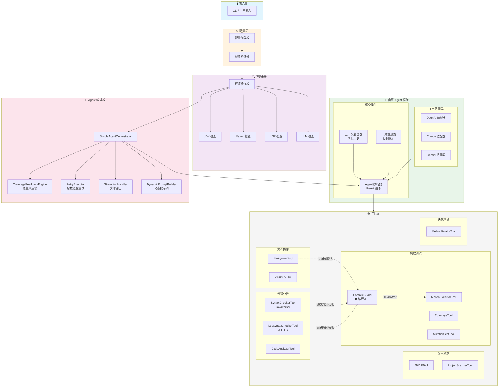
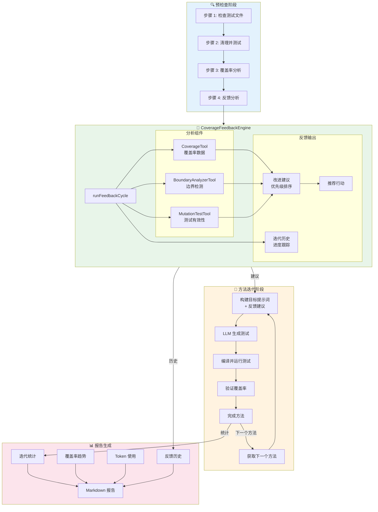

# Unit Test Agent 4j

企业级 Java 单元测试智能体，专注于为遗留系统自动生成高质量的 JUnit 5 + Mockito 测试代码。

[](https://openjdk.java.net/)
[](https://maven.apache.org/)
[](LICENSE)
[](https://github.com/codelogickeep/unit-test-agent-4j)

## v2.1.0 新特性

- 🧪 **核心框架单元测试** - 为 ContextManager、ToolRegistry、JsonUtil 添加全面测试
- 💾 **知识库索引持久化** - 缓存索引，避免每次启动重建
- 🔍 **变更影响范围分析** - 分析依赖图，识别代码变更影响的测试
- 🛑 **智能停滞检测** - 覆盖率停止增长时智能停止迭代
- 🛡️ **编译守卫机制** - 工具层面强制约束：语法检查必须通过才能编译
- ⚙️ **新配置项** - `max-stale-iterations`、`min-coverage-gain` 提供精细控制
- 📦 **自动版本检测** - 构建脚本自动获取最新 release 版本

### v2.0.0 特性回顾

- 🚀 自研轻量级 Agent 框架 - 替换 LangChain4j，使用专门构建的框架
- 🔧 更好的智谱 AI 支持 - 修复消息格式问题（1214 错误）
- 📊 改进的上下文管理 - 智能消息裁剪，保持有效对话序列
- ⚡ 减少依赖 - JAR 包体积减小约 50%
- 🔬 覆盖率反馈引擎 - 智能分析，包含边界检测和改进建议

## 目录

- [核心特性](#核心特性)
- [安装](#安装)
- [快速开始](#快速开始)
- [使用指南](#使用指南)
  - [单文件模式](#单文件模式)
  - [批量模式](#批量模式)
  - [增量模式](#增量模式)
  - [交互模式](#交互模式)
- [命令行参考](#命令行参考)
- [配置说明](#配置说明)
- [可用工具](#可用工具)
- [系统架构](#系统架构)
- [故障排除](#故障排除)
- [参与贡献](#参与贡献)

## 核心特性

| 特性 | 说明 |
|------|------|
| **多模型支持** | 原生支持 OpenAI、Anthropic (Claude)、Gemini、智谱 AI 及 OpenAI 兼容代理 |
| **自研 Agent 框架** | 轻量级专用框架（无 LangChain4j 依赖） |
| **智能环境审计** | 自动检测项目依赖（JUnit 5、Mockito、JaCoCo）及版本兼容性 |
| **自我修复机制** | 自动编译运行测试，根据错误日志修复代码 |
| **标准化测试** | 强制使用 JUnit 5 + Mockito + mockito-inline 标准 |
| **项目根保护** | 通过 `pom.xml` 检测锁定项目根目录，防止路径幻觉 |
| **指数退避重试** | 智能处理 API 速率限制 |
| **RAG 知识库** | 检索现有测试和文档，确保代码风格一致 |
| **覆盖率驱动增强** | 分析未覆盖方法，自动补充测试 |
| **覆盖率反馈引擎** | 智能反馈，包含边界分析和改进建议 |
| **Git 增量检测** | 仅为变更文件生成测试（未提交/暂存/分支间比较） |
| **变异测试** | 集成 PITest 评估测试有效性 |
| **LSP 语法检查** | 可选的 Eclipse JDT Language Server 集成，提供完整语义分析（自动下载） |
| **预编译验证** | 基于 JavaParser 的快速语法检查，编译前拦截错误 |
| **迭代方法测试** | 逐方法生成测试，按优先级排序 |
| **交互模式** | 在应用更改前预览并确认文件写入操作（安全优先的工作流） |
| **统计报告** | 生成详细的 Markdown 报告，包含 Token 使用和覆盖率趋势 |

## 安装

### 前置要求

- **JDK 21+**（必需）
- **Maven 3.8+**（必需，用于构建）
- **Git**（必需，用于克隆源码）

### 快速安装（推荐）

使用我们的一键构建脚本，自动完成环境检查、源码克隆、项目构建和安装。

#### Linux / macOS

```bash
# 一键克隆、构建并安装
curl -sSL https://raw.githubusercontent.com/codelogickeep/unit-test-agent-4j/main/build.sh | bash

# 添加到 PATH（添加到 ~/.bashrc 或 ~/.zshrc）
export PATH="$PATH:$HOME/.utagent"
```

#### Windows (PowerShell 7+)

```powershell
# 一键克隆、构建并安装
irm https://raw.githubusercontent.com/codelogickeep/unit-test-agent-4j/main/build.ps1 | iex

# 手动添加到 PATH: $env:USERPROFILE\.utagent
```

构建脚本会自动：
1. 检查环境（Java 21+、Maven 3.8+、Git）
2. 克隆源码
3. 使用 Maven 构建项目（需要 2-5 分钟）
4. 安装 `utagent` 命令到 `~/.utagent`（Windows 为 `%USERPROFILE%\.utagent`）
5. 清理构建文件

安装完成后即可使用：

```bash
# 配置 API Key
utagent config --protocol openai --api-key "sk-..." --model "gpt-4"

# 生成测试
utagent --target src/main/java/com/example/MyService.java
```

### 手动从源码构建

如果你想手动构建，请按以下步骤操作：

```bash
# 克隆仓库
git clone https://github.com/codelogickeep/unit-test-agent-4j.git
cd unit-test-agent-4j

# 构建项目
mvn clean package -DskipTests

# 创建安装目录
mkdir -p ~/.utagent

# 复制 JAR 文件
cp target/utagent.jar ~/.utagent/

# 创建命令脚本
echo '#!/usr/bin/env bash
java -jar "$HOME/.utagent/utagent.jar" "$@"' > ~/.utagent/utagent
chmod +x ~/.utagent/utagent

# 添加到 PATH
export PATH="$PATH:$HOME/.utagent"
```

### 验证安装

```bash
# 一键安装方式
utagent --help

# 从源码构建方式
java -jar target/utagent.jar --help
```

## 快速开始

### 第一步：配置 API Key

```bash
# 方式 A：使用 config 命令（推荐）
utagent config \
  --protocol openai \
  --api-key "sk-your-api-key" \
  --model "gpt-4o"

# 方式 B：设置环境变量
export OPENAI_API_KEY="sk-your-api-key"
```

### 第二步：生成第一个测试

```bash
# 一键安装方式
utagent --target src/main/java/com/example/MyService.java

# 从源码构建方式
java -jar target/utagent.jar --target src/main/java/com/example/MyService.java
```

### 第三步：查看输出

Agent 将会：
1. 分析源文件
2. 在 `src/test/java/com/example/MyServiceTest.java` 生成测试类
3. 编译并运行测试
4. 自动修复任何失败

## 使用指南

### 单文件模式

为指定的 Java 源文件生成测试。

```bash
# 基本用法
utagent --target path/to/MyService.java

# 使用知识库匹配代码风格
utagent \
  --target path/to/MyService.java \
  -kb src/test/java

# 启用交互确认
utagent \
  --target path/to/MyService.java \
  --interactive

# 自定义覆盖率阈值
utagent \
  --target path/to/MyService.java \
  --threshold 90
```

### 批量模式

扫描整个项目，为所有需要覆盖的类生成测试。

```bash
# 扫描整个项目
utagent --project /path/to/project

# 使用排除规则
utagent \
  --project /path/to/project \
  --exclude "**/dto/**,**/vo/**,**/entity/**"

# Dry-run 模式（仅分析）
utagent \
  --project /path/to/project \
  --dry-run

# 限制批量处理数量
utagent \
  --project /path/to/project \
  --batch-limit 10
```

**内置排除规则：**
- `**/dto/**`、`**/vo/**`、`**/domain/**`
- `**/*DTO.java`、`**/*VO.java`、`**/*Entity.java`
- `**/*Enum.java`、`**/*Criteria.java`
- `**/dao/**/*DAO.java`、`**/repo/**/*Repo.java`

### 增量模式

仅为 Git 中变更的文件生成测试。

```bash
# 测试未提交的变更（工作区 + 暂存区）
utagent \
  --project /path/to/project \
  --incremental

# 仅测试暂存区变更
utagent \
  --project /path/to/project \
  --incremental \
  --incremental-mode STAGED_ONLY

# 比较两个 ref（如：feature 分支 vs main）
utagent \
  --project /path/to/project \
  --incremental \
  --incremental-mode COMPARE_REFS \
  --base-ref main \
  --target-ref HEAD

# 比较特定提交
utagent \
  --project /path/to/project \
  --incremental \
  --incremental-mode COMPARE_REFS \
  --base-ref abc123 \
  --target-ref def456
```

**增量模式类型：**
| 模式 | 说明 |
|------|------|
| `UNCOMMITTED` | 工作区 + 暂存区的变更（默认） |
| `STAGED_ONLY` | 仅暂存区变更 |
| `COMPARE_REFS` | 比较两个 Git ref（分支、提交、标签） |

### 交互模式

在智能体修改代码库之前预览并确认每次文件写入操作。此模式提供额外的安全性和控制力。

#### 何时使用交互模式

**✅ 推荐用于：**
- **生产代码库** - 在应用更改前审查变更
- **关键系统** - 在提交前确保测试代码质量
- **学习/审查** - 在接受前了解智能体生成的内容
- **首次使用** - 熟悉智能体行为
- **自定义测试模式** - 验证生成的测试是否符合项目风格

**❌ 不需要用于：**
- **开发/测试环境** - 自动化工作流
- **CI/CD 流水线** - 需要非交互式执行
- **批量处理** - 太多确认会降低速度

#### 使用方法

```bash
# 通过命令行启用交互模式
utagent \
  --target path/to/MyService.java \
  --interactive

# 或使用简短形式
utagent \
  --target path/to/MyService.java \
  -i

# 或在 agent.yml 中配置
workflow:
  interactive: true
```

#### 交互式工作流程

启用交互模式后，智能体会在每次文件写入操作前暂停并显示：

1. **文件预览** - 要写入文件的前 30 行
2. **操作类型** - 创建新文件、覆盖现有文件或追加到文件
3. **文件路径** - 文件将被写入的确切位置

**交互式提示示例：**
```
╔══════════════════════════════════════════════════════════════════╗
║ 写入文件: src/test/java/com/example/MyServiceTest.java          ║
║ 操作类型: 创建新文件                                              ║
╟──────────────────────────────────────────────────────────────────╢
║ 预览（前 30 行）：                                                 ║
║                                                                  ║
║ package com.example;                                             ║
║                                                                  ║
║ import org.junit.jupiter.api.Test;                               ║
║ import org.junit.jupiter.api.extension.ExtendWith;               ║
║ import org.mockito.InjectMocks;                                  ║
║ import org.mockito.Mock;                                          ║
║ import org.mockito.junit.jupiter.MockitoExtension;               ║
║ ...                                                              ║
╟──────────────────────────────────────────────────────────────────╢
║ [Y] 确认  [n] 取消  [v] 查看完整内容                              ║
╚══════════════════════════════════════════════════════════════════╝
```

**可用操作：**
- **`Y` 或 `Enter`** - 确认并写入文件
- **`n`** - 取消此次写入操作（智能体将继续其他操作）
- **`v`** - 在决定前查看完整文件内容

#### 使用场景

**1. 审查生成的测试代码**
```bash
# 生成测试并预览
utagent --target MyService.java --interactive

# 在接受前审查每个测试文件
# 智能体显示："即将创建 MyServiceTest.java"
# 您可以：查看完整内容、确认或跳过
```

**2. 保护现有测试文件**
```bash
# 智能体检测到现有测试文件
# 显示："即将覆盖现有 MyServiceTest.java"
# 您可以：审查变更、确认或取消以保留现有测试
```

**3. 增量测试生成**
```bash
# 在启用交互模式的迭代模式下
# 智能体一次生成一个方法的测试
# 您审查并确认每批测试后再继续
```

**4. 学习智能体行为**
```bash
# 首次使用智能体？启用交互模式
# 查看生成的代码
# 了解测试模式和结构
# 在自动化模式运行前建立信心
```

#### 配置方式

您可以通过三种方式启用交互模式：

1. **命令行参数**（最高优先级）
   ```bash
   --interactive  # 或 -i
   ```

2. **配置文件**
   ```yaml
   workflow:
     interactive: true
   ```

3. **默认行为**
   - 默认值：`false`（非交互式）
   - 设置为 `true` 用于安全优先的工作流

### 工作流程阶段（内部）

完整的单测生成流程包含多个阶段，LLM 根据当前任务自动选择合适的工具：

| 阶段 | 说明 | 关键工具 |
|------|------|----------|
| **分析** | 读取并理解源代码 | CodeAnalyzerTool, FileSystemTool |
| **生成** | 生成测试文件 | FileSystemTool, KnowledgeBaseTool, SyntaxCheckerTool |
| **验证** | 编译、运行测试、检查覆盖率 | MavenExecutorTool, CoverageTool |
| **修复** | 修复失败的测试 | FileSystemTool, SyntaxCheckerTool |

所有工具在启动时加载，LLM 在每个步骤自动决定使用哪些工具。

**交互提示示例：**
```
╔══════════════════════════════════════════════════════════════════╗
║ 写入文件: src/test/java/com/example/MyServiceTest.java          ║
║ 操作类型: 创建新文件                                              ║
╟──────────────────────────────────────────────────────────────────╢
║ 预览（前 30 行）:                                                 ║
║                                                                  ║
║ package com.example;                                             ║
║                                                                  ║
║ import org.junit.jupiter.api.Test;                               ║
║ import org.junit.jupiter.api.extension.ExtendWith;               ║
║ ...                                                              ║
╟──────────────────────────────────────────────────────────────────╢
║ [Y] 确认  [n] 取消  [v] 查看完整内容                              ║
╚══════════════════════════════════════════════════════════════════╝
```

## 命令行参考

### 全局选项

| 选项 | 简写 | 说明 | 默认值 |
|------|------|------|--------|
| `--config` | `-c` | 配置文件路径 | 自动检测 |
| `--protocol` | | LLM 协议 (openai/anthropic/gemini) | 来自配置 |
| `--api-key` | | API 密钥 | 来自配置/环境变量 |
| `--base-url` | | API 基础 URL | 协议默认值 |
| `--model` | `-m` | 模型名称 | 来自配置 |
| `--temperature` | `-t` | 采样温度 (0.0-1.0) | 0.0 |
| `--timeout` | | 请求超时（秒） | 120 |
| `--max-retries` | | 最大重试次数 | 3 |
| `--verbose` | `-v` | 启用详细日志 | false |
| `--help` | `-h` | 显示帮助信息 | |

### 目标选项

| 选项 | 简写 | 说明 | 示例 |
|------|------|------|------|
| `--target` | | 单个源文件路径 | `src/main/java/Foo.java` |
| `--project` | `-p` | 批量模式的项目根目录 | `/path/to/project` |
| `--exclude` | `-e` | 排除规则（逗号分隔） | `**/dto/**,**/vo/**` |
| `--threshold` | | 覆盖率阈值 % | 80 |
| `--dry-run` | | 仅分析，不生成 | |
| `--batch-limit` | | 最大处理类数 | 无限制 |

### 增量选项

| 选项 | 说明 | 示例 |
|------|------|------|
| `--incremental` | 启用增量模式 | |
| `--incremental-mode` | 模式：UNCOMMITTED/STAGED_ONLY/COMPARE_REFS | `COMPARE_REFS` |
| `--base-ref` | 比较的基准 Git ref | `main`、`HEAD~1`、`abc123` |
| `--target-ref` | 比较的目标 Git ref | `HEAD`、`feature-branch` |

### 知识库选项

| 选项 | 简写 | 说明 | 示例 |
|------|------|------|------|
| `-kb` | | 知识库路径 | `src/test/java` |
| `--kb-types` | | 索引的文件类型 | `java,md,yml` |

### 交互选项

| 选项 | 简写 | 说明 |
|------|------|------|
| `--interactive` | `-i` | 启用交互确认模式 |

## 配置说明

### 配置文件位置

Agent 按以下顺序搜索 `agent.yml`：

1. `--config` 命令行参数
2. **JAR 所在目录**（推荐）
3. 当前工作目录
4. 用户主目录（`~/.unit-test-agent/`）

### 完整配置参考 (`agent.yml`)

```yaml
# ═══════════════════════════════════════════════════════════════════
# LLM 设置
# ═══════════════════════════════════════════════════════════════════
llm:
  # 协议：openai | openai-zhipu | anthropic | gemini
  protocol: "openai"
  
  # API 密钥 - 支持环境变量语法
  apiKey: "${env:UT_AGENT_API_KEY}"
  
  # 基础 URL - 自动处理 /v1 或 /v1beta 后缀
  # 示例：
  #   - OpenAI：https://api.openai.com（默认）
  #   - Azure：https://your-resource.openai.azure.com
  #   - 阿里云：https://dashscope.aliyuncs.com/compatible-mode/v1
  baseUrl: "${env:UT_AGENT_BASE_URL}"
  
  # 模型名称
  modelName: "${env:UT_AGENT_MODEL_NAME}"
  
  # 温度：0.0（精确）到 1.0（创造性）
  # 推荐：代码生成使用 0.0
  temperature: 0.0
  
  # 请求超时（秒）
  timeout: 120
  
  # 自定义 HTTP 头（用于代理或认证）
  customHeaders:
    # X-Custom-Header: "value"

# ═══════════════════════════════════════════════════════════════════
# 工作流设置
# ═══════════════════════════════════════════════════════════════════
workflow:
  # 失败后最大重试次数（指数退避）
  maxRetries: 3
  
  # 覆盖率阈值（%）- 未达标时自动补充测试
  coverageThreshold: 80
  
  # 交互模式 - 在每次文件写入操作前预览并确认
  # 启用后，智能体在写入/修改文件前会暂停并显示：
  #   - 文件预览（前 30 行）
  #   - 操作类型（创建/覆盖/追加）
  #   - 文件路径
  # 使用场景：生产代码库、关键系统、学习智能体行为
  # 默认值：false（非交互式，适用于 CI/CD 和批量处理）
  interactive: false
  
  # 启用 LSP 语法检查（自动下载 JDT LS 1.50.0，支持 JDK 21+）
  # 提供完整语义分析：类型错误、缺失导入
  use-lsp: false
  
  # 启用迭代方法测试模式
  iterative-mode: false
  
  # 每方法覆盖率阈值（迭代模式）
  method-coverage-threshold: 80
  
  # 覆盖率达标时跳过低优先级方法（getters/setters）
  skip-low-priority: false

# ═══════════════════════════════════════════════════════════════════
# 批量模式设置
# ═══════════════════════════════════════════════════════════════════
batch:
  # 排除规则（glob 模式，逗号分隔）
  excludePatterns: "**/dto/**,**/vo/**,**/entity/**"
  
  # Dry-run 模式 - 仅分析，不生成
  dryRun: false

# ═══════════════════════════════════════════════════════════════════
# 增量模式设置
# ═══════════════════════════════════════════════════════════════════
incremental:
  # 模式：UNCOMMITTED | STAGED_ONLY | COMPARE_REFS
  mode: UNCOMMITTED
  
  # COMPARE_REFS 模式的 Git ref
  # baseRef: "main"
  # targetRef: "HEAD"

# ═══════════════════════════════════════════════════════════════════
# 推荐依赖（环境自检使用）
# ═══════════════════════════════════════════════════════════════════
dependencies:
  junit-jupiter: "5.10.1"
  mockito-core: "5.8.0"
  mockito-junit-jupiter: "5.8.0"
  mockito-inline: "5.8.0"
  jacoco-maven-plugin: "0.8.11"

# ═══════════════════════════════════════════════════════════════════
# Prompts 配置
# ═══════════════════════════════════════════════════════════════════
prompts:
  # 系统提示词模板路径（文件或 classpath 资源）
  system: "prompts/system-prompt.st"

# ═══════════════════════════════════════════════════════════════════
# Skills 配置（动态工具选择）
# 通过仅加载相关工具减少约 60-70% 的 Token 消耗
# ═══════════════════════════════════════════════════════════════════
skills:
  - name: "analysis"
    description: "代码分析阶段"
    tools: [CodeAnalyzerTool, FileSystemTool, BoundaryAnalyzerTool, StyleAnalyzerTool, ProjectScannerTool, TestDiscoveryTool]
  - name: "generation"
    description: "测试生成阶段"
    tools: [FileSystemTool, DirectoryTool, KnowledgeBaseTool, SyntaxCheckerTool, CodeAnalyzerTool]
  - name: "verification"
    description: "测试验证阶段"
    tools: [MavenExecutorTool, TestReportTool, CoverageTool, FileSystemTool, MutationTestTool]
  - name: "repair"
    description: "修复阶段"
    tools: [FileSystemTool, TestReportTool, CodeAnalyzerTool, SyntaxCheckerTool, MavenExecutorTool]
  - name: "full"
    description: "完整工具集（默认）"
    tools: []  # 空数组表示使用全部工具

# 在 workflow 中设置默认 skill:
# workflow:
#   default-skill: "analysis"
```

### 环境变量

| 变量 | 说明 | 示例 |
|------|------|------|
| `UT_AGENT_API_KEY` | LLM API 密钥 | `sk-xxx` |
| `UT_AGENT_BASE_URL` | LLM API 基础 URL | `https://api.openai.com` |
| `UT_AGENT_MODEL_NAME` | 模型名称 | `gpt-4o` |

### 协议配置示例

#### OpenAI / OpenAI 兼容

```yaml
llm:
  protocol: "openai"
  apiKey: "sk-..."
  modelName: "gpt-4o"
  # 代理配置：
  # baseUrl: "https://your-proxy.com/v1"
```

#### Anthropic (Claude)

```yaml
llm:
  protocol: "anthropic"
  apiKey: "sk-ant-..."
  modelName: "claude-3-5-sonnet-20240620"
```

#### Google Gemini

```yaml
llm:
  protocol: "gemini"
  apiKey: "AI..."
  modelName: "gemini-1.5-pro"
```

#### 智谱 AI (GLM)

```yaml
llm:
  protocol: "openai-zhipu"
  apiKey: "your-zhipu-api-key"
  modelName: "glm-4.7"
  baseUrl: "https://open.bigmodel.cn/api/coding/paas/v4"
```

#### 阿里云（百炼 / DashScope）

```yaml
llm:
  protocol: "openai"
  apiKey: "sk-..."
  baseUrl: "https://dashscope.aliyuncs.com/compatible-mode/v1"
  modelName: "qwen-max"
```

## 可用工具

Agent 可以使用以下工具：

### 文件系统工具

| 工具 | 说明 |
|------|------|
| `readFile` | 读取文件内容 |
| `writeFile` | 写入文件内容 |
| `fileExists` | 检查文件是否存在 |
| `searchReplace` | 文件中搜索替换 |
| `listFiles` | 列出目录内容 |
| `createDirectory` | 创建目录 |

### 代码分析工具

| 工具 | 说明 |
|------|------|
| `analyzeClass` | 分析 Java 类结构（方法、字段、依赖） |
| `analyzeMethod` | 获取方法详细分析（复杂度、分支） |
| `getMethodsForTesting` | 列出适合测试的公共方法 |
| `scanProjectClasses` | 扫描项目源类 |

### 语法检查工具

| 工具 | 说明 |
|------|------|
| `checkSyntax` | 快速 JavaParser 语法验证（~10ms） |
| `checkSyntaxContent` | 检查代码字符串的语法 |
| `validateTestStructure` | 验证 JUnit 5 测试类结构（@ExtendWith、@Mock、@Test） |
| `initializeLsp` | 初始化 JDT Language Server 进行语义检查 |
| `checkSyntaxWithLsp` | 完整语义分析（类型错误、缺失导入） |
| `shutdownLsp` | 释放 LSP 服务资源 |

### Maven 工具

| 工具 | 说明 |
|------|------|
| `compileProject` | 运行 `mvn compile`（语法检查未通过时会被阻止） |
| `executeTest` | 运行特定测试类 |

### 编译守卫 (v2.1.0)

`CompileGuard` 在工具层面强制执行"先语法检查再编译"的工作流：

```
writeFile(*.java) → markFileModified()
     ↓
checkSyntax() → 通过 → markSyntaxPassed() → compileProject() ✅
     ↓
   失败 → markSyntaxFailed() → 修复代码 → 重新检查
     ↓
未通过 checkSyntax() 直接调用 compileProject() → ❌ COMPILE_BLOCKED
```

**优势：**
- 防止对无效代码进行无效编译尝试
- 提供清晰的修复指引
- 减少迭代次数和 Token 消耗

### 覆盖率工具

| 工具 | 说明 |
|------|------|
| `getCoverageReport` | 获取整体覆盖率摘要 |
| `checkCoverageThreshold` | 检查类是否达到覆盖率阈值 |
| `getMethodCoverageDetails` | 获取方法级覆盖率详情 |
| `getSingleMethodCoverage` | 获取单个方法的覆盖率（迭代模式） |
| `getUncoveredMethods` | 获取低于阈值的未覆盖方法列表 |

### 覆盖率反馈引擎

`CoverageFeedbackEngine` 提供智能分析和改进建议：

| 功能 | 说明 |
|------|------|
| **反馈周期** | 分析覆盖率，识别未覆盖区域，生成优先级排序的建议 |
| **边界分析** | 集成 `BoundaryAnalyzerTool` 识别边界测试机会 |
| **变异分析** | 可选集成 `MutationTestTool` 评估测试有效性 |
| **改进建议** | 优先级排序：缺失测试、边界测试、变异存活 |
| **迭代历史** | 跟踪多轮迭代的覆盖率进展 |
| **智能停止** | 检测到无进展时自动停止迭代 |

### 迭代测试工具

| 工具 | 说明 |
|------|------|
| `initMethodIteration` | 为类初始化方法迭代 |
| `getNextMethod` | 获取下一个待测试方法 |
| `completeCurrentMethod` | 标记当前方法为已完成 |
| `getIterationProgress` | 获取迭代进度摘要 |
| `skipLowPriorityMethods` | 跳过剩余低优先级方法 |

### Git 工具

| 工具 | 说明 |
|------|------|
| `getUncommittedChanges` | 列出未提交的文件变更 |
| `getStagedChanges` | 列出暂存的文件变更 |
| `getChangesBetweenRefs` | 列出两个 Git ref 之间的变更 |
| `listBranches` | 列出所有分支 |
| `getFileDiff` | 获取文件的详细差异 |

### 知识库工具

| 工具 | 说明 |
|------|------|
| `searchKnowledge` | 在知识库中搜索模式 |
| `searchTestingGuidelines` | 查找测试规范 |
| `searchTestExamples` | 查找现有测试示例 |

## 系统架构



### 组件说明

| 层级 | 组件 | 说明 |
|------|------|------|
| **输入层** | CLI | 基于 picocli 的命令行界面 |
| **配置层** | ConfigLoader | 支持环境变量的 YAML 配置 |
| **环境审计** | EnvironmentChecker | 验证 JDK、Maven、LSP、LLM 可用性 |
| **Agent 框架** | 自研轻量级框架 | 多 LLM 支持的 ReAct 循环 |
| **编排器** | SimpleAgentOrchestrator | 核心循环，支持重试和流式输出 |
| **反馈引擎** | CoverageFeedbackEngine | 智能覆盖率分析和改进建议 |
| **编译守卫** | CompileGuard | 工具层面强制语法检查通过才能编译 |
| **工具层** | 15+ 工具 | 文件、代码、构建、Git、覆盖率操作 |

### 自研框架 vs LangChain4j

| 对比项 | 自研框架 (v2.0.0) | LangChain4j (v1.0.0) |
|--------|-------------------|----------------------|
| **JAR 大小** | ~15MB | ~30MB |
| **依赖数** | 8 核心 | 20+ |
| **智谱 AI** | 完全支持，已修复 1214 | 部分支持，消息格式问题 |
| **上下文控制** | 精细控制 | 有限 |
| **启动时间** | 更快 | 较慢 |

### CoverageFeedbackEngine 集成架构

`CoverageFeedbackEngine` 提供智能覆盖率分析，集成到测试生成工作流中：



**工作流集成点：**

| 阶段 | 集成方式 | 说明 |
|------|---------|------|
| **预检查** | 初始分析 | 运行 `runFeedbackCycle()` 获取基准覆盖率和建议 |
| **方法提示词** | 定向建议 | 将方法特定和边界测试建议注入 LLM 提示词 |
| **迭代控制** | 智能停止 | 使用 `shouldContinueIterating()` 检测停滞 |
| **报告** | 历史摘要 | 在最终 Markdown 报告中包含 `getIterationSummary()` |

**建议类型：**

| 类型 | 优先级 | 说明 |
|------|--------|------|
| `MISSING_TEST` | 高 | 未覆盖方法需要测试 |
| `BOUNDARY_TEST` | 中 | 识别到边界条件 |
| `MUTATION_SURVIVOR` | 高 | 变异存活 - 加强断言 |
| `WEAK_ASSERTION` | 低 | 断言可以更强 |

## 故障排除

### 常见问题

#### 1. API Key 未找到

**错误：** `LLM API Key is missing`

**解决方案：**
```bash
# 通过环境变量设置
export UT_AGENT_API_KEY="your-key"

# 或通过 config 命令设置
java -jar utagent.jar config --api-key "your-key"
```

#### 2. Maven 未找到

**错误：** `Maven not found in PATH`

**解决方案：**
- 安装 Maven 3.8+
- 将 Maven 添加到 PATH
- 验证：`mvn --version`

#### 3. JaCoCo 报告未找到

**错误：** `JaCoCo coverage report not found`

**解决方案：**
```bash
# 确保 pom.xml 中配置了 JaCoCo
# 运行测试生成覆盖率报告
mvn clean test jacoco:report
```

#### 4. 速率限制超出 (1302 错误)

**错误：** `您当前使用该API的并发数过高`

**解决方案：**
- Agent 会自动使用指数退避重试
- 如需要可增加 `--timeout` 和 `--max-retries`
- 考虑使用更高级别的 API 套餐
- 在请求之间增加延迟

#### 5. 智谱 AI 1214 错误（v2.0.0 已修复）

**错误：** `messages 参数非法`

**解决方案：**
- 升级到 v2.0.0
- 自研框架（v2.0.0 默认）正确处理智谱 AI 消息格式

#### 7. 测试编译失败

**错误：** `Compilation failed`

**解决方案：**
- Agent 会尝试自动修复
- 检查 pom.xml 中是否有所有依赖
- 验证 Mockito 版本兼容性

### 启用详细日志

```bash
# 通过命令行
java -jar utagent.jar --target Foo.java -v

# 通过系统属性
java -Dut.agent.log.level=DEBUG -jar unit-test-agent-4j.jar --target Foo.java
```

### 日志级别

| 级别 | 内容 |
|------|------|
| `INFO` | 用户进度、关键里程碑 |
| `DEBUG` | 工具输入/输出、技术细节 |
| `WARN` | 非致命问题 |
| `ERROR` | 需要关注的失败 |

## 参与贡献

欢迎贡献！请参阅 [CONTRIBUTING.md](CONTRIBUTING.md) 了解指南。

### 开发环境设置

```bash
# 克隆仓库
git clone https://github.com/your-org/unit-test-agent-4j.git
cd unit-test-agent-4j

# 构建并测试
mvn clean verify

# 运行特定测试
mvn test -Dtest=FileSystemToolTest
```

### 项目结构

```
unit-test-agent-4j/
├── src/main/java/com/codelogickeep/agent/ut/
│   ├── config/           # 配置加载与验证
│   ├── engine/           # 核心引擎
│   │   ├── CoverageFeedbackEngine.java  # 智能覆盖率分析
│   │   ├── RetryExecutor.java           # 指数退避重试
│   │   ├── EnvironmentChecker.java      # 环境验证
│   │   ├── BatchAnalyzer.java           # 批量模式分析
│   │   └── DynamicPromptBuilder.java    # 上下文感知提示词
│   ├── framework/        # 自研轻量级框架 (v2.0.0)
│   │   ├── adapter/      # LLM 适配器 (OpenAI, Claude, Gemini, 智谱)
│   │   ├── context/      # 上下文管理
│   │   ├── executor/     # ReAct 循环执行器
│   │   ├── model/        # 消息模型、迭代统计
│   │   └── tool/         # 工具注册与执行
│   ├── exception/        # 自定义异常
│   └── tools/            # Agent 工具 (15+)
│       ├── FileSystemTool.java
│       ├── CodeAnalyzerTool.java
│       ├── CoverageTool.java
│       ├── BoundaryAnalyzerTool.java
│       ├── MutationTestTool.java
│       ├── MethodIteratorTool.java
│       └── ...
├── src/test/java/        # 单元测试
├── doc/                  # 文档
├── prompts/              # 提示词模板
├── result/               # 生成的报告（自动创建）
└── pom.xml
```

## 许可证

本项目采用 Apache License 2.0 许可证 - 详见 [LICENSE](LICENSE) 文件。

---

**献给那些厌倦手写测试的 Java 开发者 ❤️**
