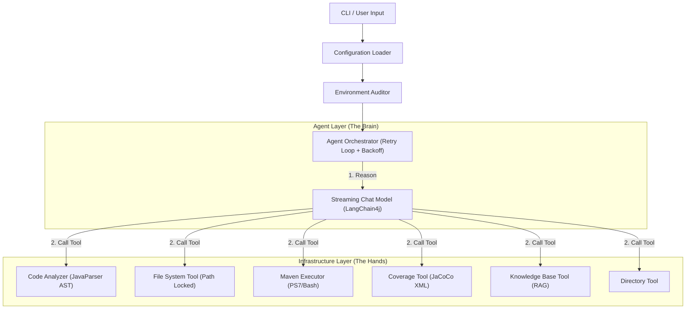

# Project Specification: unit-test-agent-4j

**Repository Name:** `unit-test-agent-4j`
**Root Package:** `com.codelogickeep.agent.ut`
**Version:** 0.1.0-LITE
**Language:** Java 21
**Build System:** Maven
**Architecture Style:** Agent-Tool Layered Architecture

---

## 1. 项目愿景 (Vision)

构建一个企业级的 Java 单元测试智能体 (Agent)，专注于为遗留系统 (Legacy Code) 自动生成高质量的 JUnit 5 + Mockito 测试代码。

**核心特性：**
- **多模型原生支持**: 原生支持 OpenAI、Anthropic (Claude) 和 Gemini 协议
- **智能环境审计**: 启动时自动检测项目依赖及版本
- **自我修复机制**: 根据错误日志自动修复测试代码或 `pom.xml`
- **项目根目录保护**: 通过 `pom.xml` 锁定项目根目录，防止路径幻觉
- **RAG 知识库**: 检索现有单测案例，确保生成代码风格一致
- **覆盖率驱动**: 支持设置覆盖率阈值，未达标时自动补充测试

---

## 2. 核心架构 (Architecture)

系统采用 **Agent-Tool** 两层架构。



---

## 3. 目录结构规范 (Directory Structure)

严格遵循 Maven 标准目录结构，包路径为 `com.codelogickeep.agent.ut`。

```text
unit-test-agent-4j/
├── pom.xml
├── agent.yml                      <-- 默认配置文件
├── doc/
│   └── spec.md                    <-- 本规范文档
├── src/
│   ├── main/
│   │   ├── java/
│   │   │   └── com/codelogickeep/agent/ut/
│   │   │       ├── App.java                      <-- CLI Entry (Picocli)
│   │   │       ├── config/
│   │   │       │   └── AppConfig.java            <-- YAML Config Model
│   │   │       ├── engine/
│   │   │       │   ├── AgentOrchestrator.java    <-- Core Loop + Retry
│   │   │       │   ├── LlmClient.java            <-- Multi-Protocol LLM
│   │   │       │   └── EnvironmentChecker.java   <-- Dependency Auditor
│   │   │       ├── model/
│   │   │       │   └── Context.java
│   │   │       └── tools/
│   │   │           ├── AgentTool.java            <-- Tool Marker Interface
│   │   │           ├── ToolFactory.java          <-- Auto-Discovery
│   │   │           ├── FileSystemTool.java       <-- File R/W (Path Locked)
│   │   │           ├── DirectoryTool.java        <-- Directory Operations
│   │   │           ├── CodeAnalyzerTool.java     <-- AST Parser
│   │   │           ├── MavenExecutorTool.java    <-- Build & Test Runner
│   │   │           ├── CoverageTool.java         <-- JaCoCo Report Parser
│   │   │           └── KnowledgeBaseTool.java    <-- RAG Vector Search
│   │   └── resources/
│   │       ├── logback.xml
│   │       ├── agent.yml                         <-- Default Config
│   │       └── prompts/
│   │           └── system-prompt.st              <-- System Prompt Template
│   └── test/
│       └── java/
│           └── com/codelogickeep/agent/ut/
│               └── ...                           <-- Unit Tests
```

---

## 4. 详细组件设计 (Component Design)

### 4.1 CLI 入口 (`App.java`)

基于 Picocli 实现，支持：
- 主命令：`--target` 指定目标文件生成测试
- 批量模式：`--project` 指定工程目录批量生成
- 子命令：`config` 配置持久化
- 参数覆盖：`--protocol`, `--api-key`, `--model`, `--temperature`, `--max-retries`
- 批量参数：`--exclude`, `--threshold`, `--dry-run`
- 环境检查：`--check-env`
- 知识库：`-kb` 指定 RAG 知识库路径

### 4.2 配置加载 (`AppConfig.java`)

配置优先级（从低到高）：
1. Classpath `agent.yml`
2. 用户目录 `~/.unit-test-agent/agent.yml`
3. 当前目录 `agent.yml`
4. JAR 目录 `agent.yml`
5. CLI `--config` 指定路径

支持环境变量替换：`${env:VAR_NAME}`

### 4.3 Agent 引擎层

#### `LlmClient.java`
- 支持三种协议：`openai`, `anthropic`, `gemini`
- 自动处理 Base URL 后缀 (`/v1`, `/v1beta`)
- 创建 `StreamingChatModel` 实例

#### `AgentOrchestrator.java`
- 管理 Agent 主循环
- 流式输出 Token
- 指数退避重试机制
- 动态加载 System Prompt

#### `EnvironmentChecker.java`
- 检测 Maven 环境
- 审计项目依赖版本（JUnit, Mockito, JaCoCo）
- 输出环境报告

### 4.4 工具层 (Infrastructure Tools)

**原则：** 所有工具实现 `AgentTool` 标记接口，由 `ToolFactory` 自动发现和注册。

| 工具类 | 功能 | LangChain4j 方法 |
|--------|------|------------------|
| `FileSystemTool` | 文件读写（路径锁定） | `readFile`, `writeFile`, `writeFileFromLine`, `searchReplace`, `fileExists` |
| `DirectoryTool` | 目录操作 | `directoryExists`, `createDirectory`, `listFiles` |
| `CodeAnalyzerTool` | AST 解析 | `analyzeClass`, `analyzeMethodDetails` |
| `MavenExecutorTool` | 构建/测试执行 | `compileProject`, `executeTest` |
| `CoverageTool` | 覆盖率报告 | `getCoverageReport`, `getUncoveredMethodsList` |
| `KnowledgeBaseTool` | RAG 向量搜索 | `searchKnowledge` |
| `ProjectScannerTool` | 工程扫描 | `getSourceClassPaths` |
| `TestDiscoveryTool` | 测试类发现 | `findTestClasses` |

#### 路径安全机制
`FileSystemTool` 通过 `projectRoot` 锁定：
- 所有路径操作限制在项目根目录内
- 自动检测 `pom.xml` 确定项目边界
- 拒绝绝对路径和 `..` 路径穿越

---

## 5. 配置规范 (`agent.yml`)

```yaml
# LLM 设置
llm:
  protocol: "openai"                    # openai | anthropic | gemini
  apiKey: "${env:UT_AGENT_API_KEY}"     # 支持环境变量
  baseUrl: "${env:UT_AGENT_BASE_URL}"   # 可选，自动处理后缀
  modelName: "${env:UT_AGENT_MODEL_NAME}"
  temperature: 0.0                      # 推荐 0.0-0.1
  timeout: 120                          # 超时秒数

# 工作流设置
workflow:
  maxRetries: 3                         # 最大重试次数
  coverageThreshold: 80                 # 覆盖率阈值 (%)

# 推荐依赖版本 (环境审计使用)
dependencies:
  junit-jupiter: "5.10.1"
  mockito-core: "5.8.0"
  mockito-junit-jupiter: "5.8.0"
  mockito-inline: "5.8.0"
  jacoco-maven-plugin: "0.8.11"

# Prompt 配置
prompts:
  system: "prompts/system-prompt.st"
```

---

## 6. Prompt 策略 (Prompt Engineering)

System Prompt 位于 `src/main/resources/prompts/system-prompt.st`，包含：

1. **角色定义**: Java QA Engineer
2. **工作空间规则**: 路径限制、文件类型处理
3. **工作流程**: 6 步标准流程
   - 环境准备 → 代码分析 → RAG 检索 → 测试规划 → 生成写入 → 验证修复
4. **工具使用规范**: 错误处理、路径准确性
5. **输出格式**: Deep Thinking + 代码标准

---

## 7. 平台兼容性

| 平台 | Shell | 说明 |
|------|-------|------|
| Windows | PowerShell 7 (pwsh) | 优先探测，自动处理路径编码 |
| Linux/macOS | sh | 标准 POSIX shell |

---

## 8. 开发路线图 (Roadmap)

### Phase 1: 核心功能 ✅ 已完成
- [x] CLI 框架 (Picocli)
- [x] 多层配置加载
- [x] 多协议 LLM 支持
- [x] 基础工具集
- [x] Agent 编排器
- [x] 环境审计

### Phase 2: 增强功能 ✅ 已完成
- [x] RAG 知识库
- [x] 覆盖率报告读取
- [x] 覆盖率阈值驱动的补充测试
- [x] 批量处理模式
- [x] 交互式确认
- [x] 精准单测生成（预分析减少 LLM 调用）

### Phase 3: 企业特性 📋 规划中
- [ ] ERP 项目适配（复杂依赖处理）
- [ ] 增量测试生成
- [ ] IDE 插件集成
- [ ] GraalVM Native Image

---

## 9. 依赖清单

| 依赖 | 版本 | 用途 |
|------|------|------|
| picocli | 4.7.5 | CLI 框架 |
| langchain4j | 1.10.0 | AI Agent 框架 |
| langchain4j-open-ai | 1.10.0 | OpenAI 协议 |
| langchain4j-anthropic | 1.10.0 | Anthropic 协议 |
| langchain4j-google-ai-gemini | 1.10.0 | Gemini 协议 |
| langchain4j-embeddings-all-minilm-l6-v2 | 1.10.0-beta18 | 本地嵌入模型 |
| javaparser-core | 3.25.10 | AST 解析 |
| jackson-dataformat-yaml | 2.17.0 | YAML 配置 |
| spring-expression | 6.1.8 | SpEL 表达式 |
| reflections | 0.10.2 | 工具自动发现 |
| logback-classic | 1.4.14 | 日志 |
